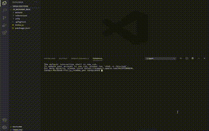

# Readme Generator

## Description
This project will use nodeJS with inquirer to generate a readme.md file based on use input.
## Table of Contents
* [`Project`](#)
* [`Description`](#Description)
* [`Table of Contents`](#Table%20of%20Contents)
* [`1nstallation Steps`](#Installation%20Steps)
* [`Usage Information`](#Usage%20Information)
* [`Testing`](#Testing)
* [`License`](#License)
* [`Contributing`](#Contributing)
* [`Questions`](#Questions)
* [`Sample`](#Sample)
## Installation Steps
To install this project, do the following:
> 1. Ensure you have VS Code installed
> 2. Ensure you have node JS installed
> 3. Ensure you have npm installed
> 4. Clone repository into working directory
> 5. Run "npm install" to install packages

## Usage Information
To use this project, do the following:
> 1. Perform steps listed under Installation Steps
> 2. Run via "node index.js"
> 3. Follow Prompts to enter user data.
> 4. On editor inputs, the default VS Code editor will open.
> 5. Enter user data in editor and your response will be captured when you save and close the editor
> 6. Readme will be generated once all prompts are complete
> 7. View readme.md file to verify everything is good.

## Testing
To test this project, do the following:
> 1. Perform steps listed under Installation Steps
> 2. Perform steps listed under Usage Information

## License
This project is provided under the None license. For more information on license details click here 
## Contributing
If you wish to contribute, do the following:
> Submit a pull request or contact directly to contribute.
## Questions
If you have any question about this repo, you may open an issue or contact me directly at jyoung7223@yahoo.com
You can find more of my work at [My Github Repo](https://github.com/Jyoung7223 "My GitHub Repo")
## Sample
Deployed project can be found at: https://github.com/JYoung7223/jy_readme_gen

Below is a sample screenshot:

